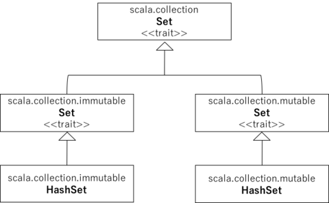
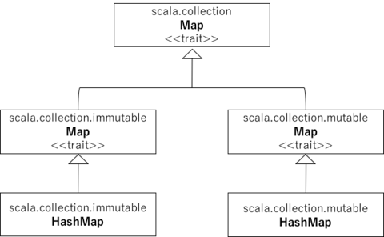

# Chapter3 Scalaプログラミングの次の第一歩
## [ステップ7]配列を型でパラメータ化する
```Scala
val greetStrings = new Array[String](3)
greetStrings(0) = "Hello"
greetStrings(1) = ", "
greetStrings(2) = "world!\n"
for(i <- 0 to 2)
	print(greetStrings(i))
```

配列を型を指定して初期化する方法
```Scala
val 変数名 = new Array[配列の型](配列のサイズ)
```

for文に使っている0 to 2という公文は(0).to(2)というメソッド呼び出しに書き換えられる。

Scalaには演算子は存在せず、演算はすべてメソッドである。
```
1 + 2
↓
(1).+(2)

値が1のIntオブジェクトの+というメソッドを呼び出して、+メソッドにIntオブジェクトの2を渡している。
```

```Scala
greetStrings(0) = "Hello" //この式は以下の式に変換さえる。
greetStrings.update(0,"Hello")


greetStrings(0) //この式は以下の式に変換される
greetStrings.apply(0)
```

Scalaは配列から式に至るまで、あらゆるものがメソッドを持つオブジェクトである。


配列の作成と初期化
```Scala
val numNames = Array("zero", "one", "two")
```
長さが3で渡された"zero", "one", "two"で初期化された新しい配列を作成する。型推論を行いStringの配列となる。


ここでは新しい配列を作って返すapplyというファクトリーメソッドの呼び出しである。このapplyメソッドは可変長の引数を取ることができるArrayコンパニオンオブジェクト(companion object)で定義されている。

```Scala
val numNames2 = Array.apply("zero", "one", "two")
```

## 3.2 [ステップ8]リストを使う。
関数型プログラミングの考え方:メソッドは副作用を持っていてはならない.

Arrayはミュータブル(変更可能)なオブジェクトである。イミュータブル(変更不可能)としたものがScala.Listである。(Java.util.Listはミュータブルにできる。)


Listの初期化は以下のように行う。
```Scala
val oneTwoThree = List(1,2,3)
```

oneTwoThreeList.scala
```Scala
val oneTwo = List(1,2)
val threeFour = List(3,4)
val oneTwoThreeFour = oneTwo ::: threeFour
println(oneTwo + " and " + threeFour + " were not mutated.")
println("Thus, " + oneTwoThreeFour + " is a new list.")
```

```
$ scala oneTwoThreeList.scala
List(1, 2) and List(3, 4) were not mutated.
```

重要なListメソッド


|コード|意味|
|:----|:---|
|List() またはNil||
|List("Cool","tools","rule")|"Cool","tools","rule"の3個の値をもつ新しいList[String]を作る。|
|var thrill = "Will"::"fill"::"until"::Nil|"Will","fill","until"の3個の値を持つ新しいList[String]を作る。|
|List("a","b"):::List("c","d")|2個のリストを連結し4個の値をもつ新しいList[String]を返す。|
|thrill(2)|thrillリストの添字2の要素を返す("until"が返される)|
|thrill.count(s=>s.length == 4)|thrillの中で長さが4の要素の数を返す。(2が返される)|
|thrill.drop(2)|先頭の2要素を取り除いたthrillリストを返す。|
|thrill.dropRight(2)|末尾の2要素を取り除いたthrillリストを返す。|
|thrill.exists(s=>s=="until")|thrillの中に"until"の要素があるかどうかを返す(true)|
|thrill.filter(s=>s.length==4)|thrillに含まれる長さが4の全ての要素を順に並べたリストを返す。|
|thrill.forall(s=>s.endsWith("l"))|thrillリストのすべての要素について、末尾の文字が"l"になっているかどうかを返す。(true)|
|thrill.foreach(s=>print(s))|thrillリストに含まれる全要素に対して1つずつprint文を実行する。|
|thrill.foreach(print)|上と同じ。|
|thrill.head|thrillリストの先頭要素を返す。|
|thrill.init|thrillリストから末尾の要素を覗いた残りのリストを返す。|
|thrill.isEmpty|thrillリストが空かどうかを返す。|
|thrill.last|thrillリストの最後の要素を返す。|
|thrill.length|thrillリストの要素数を返す|
|thrill.map(s=>s+"y")|thrillリストの各要素の"y"を追加したものから構成されるリストを返す。|
|thrill.mkString(", ")|リストの要素を並べた文字列を作る。|
|thrill.remove(s=>s.length=4)|thrillリストに含まれる長さ4以外の全ての要素を並べたリストを返す。|
|thrill.reverse|thrillリストのすべての要素を逆に並べたリストを返す。|
|thrill.sort((s,t)=>s.charAt(0).toLower<t.charAt(0).toLower)|thrillリストのすべての要素から先頭文字を小文字にしてアルファベット順を決めて、その順序に従ったリストを作って返す。|
|thrill.tail|thrillリストから先頭要素を取り除いたものを返す。|

## 3.3 [ステップ9]タプルを使う
タプルには異なる方の値を入れることができる。
タプルの要素へのアクセスは.\_要素の番号でアクセスできる。
この番号は配列などとは異なり1から始まる通し番号となっている。
```Scala
var pair = (99,"luftballons")
println(pair._1)
println(pair._2)
```

## 3.4 [ステップ10]集合とマップを使う
集合(Set)とマップ(Map)にもミュータブル版とイミュータブル版が存在する。

traitとはjavaでいうinterfaceである。Scalaではtraitを拡張[extend]あるいはミックスイン[mixin]する。

### 3.4.1 Set


[immutableSet.scala](immutableSet.scala)
```Scala
var jetSet = Set("Boeing", "Airbus")
jetSet += "Lear"
println(jetSet.contains("Cessna"))
```

immutableのSetにおける+=は下のように解釈される
```Scala
jetSet+="Lear"
↓
jetSet=jetSet+"Lear"
```
immutable.Setでは再代入をしている。そのため、varでSetを定義しないと再代入できない。


次にmutable.Setの例を示す。

mutableSet.scala
```Scala
import scala.collection.mutable.Set
val movieSet = Set("Hitch", "Poltergeist")
movieSet += "Shrek"
println(movieSet)
```
こちらはmutableなSetなのでvalで定義しても大丈夫である。

### 3.4.2 Map


mutableMap.scala
```Scala
import scala.collection.mutable.Set
val movieSet = Set("Hitch", "Poltergeist")
movieSet += "Shrek"
println(movieSet)
```


immutableMap.scala
```Scala
val romanNumeral = Map(
    1->"I", 2->"II", 3->"III", 4->"IV", 5->"V"
)
println(romanNumeral(4))
```

## 3.5 [ステップ11]関数型のスタイルを見分ける
```Scala
def printArgs(args: Array[String]): Unit = {
  var i = 0
  while(i < args.length){
    println(args(i))
    i += 1
  }
}
```
↓varをなくす
```Scala
def printArgs(args: Array[String]): Unit = {
  for(arg <- args)
    println(arg)
}
```
or
```Scala
def printArgs(args: Array[String]): Unit = {
  args.foreach(println)
}
```
↓Unitを返している限り副作用がる。出力用のStringを返すようにすることで完全に副作用を無くせる。
```Scala
def formatArgs(args: Array[String]) = args.mkString("\n")
```

## 3.6 [ステップ12]ファイルから行を読み出す
```Scala
import scala.io.Source

if(args.length > 0){
  for(line <- Source.fromFile(args(0)).getLines())
    println(line.length + " " + line)
}
else
  Console.err.println("Please enter filename")
```

```
22 import scala.io.Source
0
20 if(args.length > 0){
50   for(line <- Source.fromFile(args(0)).getLines())
37     println(line.length + " " + line)
1 }
4 else
46   Console.err.println("Please enter filename")
```


```Scala
import scala.io.Source
def widthOfLength(s:String) = s.length.toString.length//sの文字数の桁数を計算する関数
if(args.length > 0){
  val lines = Source.fromFile(args(0)).getLines().toList//getLinesはイテレータなので反復処理が終わるともう使えなくなるのでリスト化する
  val longestLine = lines.reduceLeft(
    (a,b)=>if(a.length>b.length)a else b
  )//最大行幅の計算
  val maxWidth = widthOfLength(longestLine)
  for(line <- lines){
    val numSpaces = maxWidth - widthOfLength(line)
    val padding = " " * numSpaces
    println(padding + line.length + " | " + line)
  }
}
else
  Console.err.println("Please enter filename")
```
```
22 | import scala.io.Source
54 | def widthOfLength(s:String) = s.length.toString.length
20 | if(args.length > 0){
56 |   val lines = Source.fromFile(args(0)).getLines().toList
37 |   val longestLine = lines.reduceLeft(
40 |     (a,b)=>if(a.length>b.length)a else b
 3 |   )
43 |   val maxWidth = widthOfLength(longestLine)
21 |   for(line <- lines){
50 |     val numSpaces = maxWidth - widthOfLength(line)
33 |     val padding = " " * numSpaces
49 |     println(padding + line.length + " | " + line)
 3 |   }
 1 | }
 4 | else
46 |   Console.err.println("Please enter filename")
```
